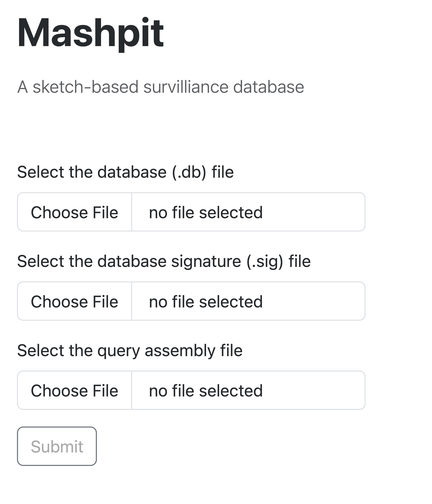

# Mashpit
[](http://bioconda.github.io/recipes/mashpit/README.html)

[](https://www.gnu.org/licenses/old-licenses/gpl-2.0.en.html)
[](https://pypi.python.org/pypi/mashpit/)
[](https://github.com/psf/black)

**Mashpit** is a fast and lightweight genomic epidemiology platform designed to create a database of Mash signatures and find the most similar genomes to a target sample. With Mashpit, users can:
 - **Perform rapid queries:** Search genomic assemblies against these databases, ranked by Mash distance.
 - **Integrate metadata:** Include epidemiological details such as isolation date, geography, and host information.
 - **Generate phylogenetic trees:** Quickly visualize genomic relationships using trees constructed from Mash distances.

Optimized for local use, Mashpit minimizes computational requirements while delivering high performance, making it particularly suitable for working with sensitive data or in environments with limited infrastructure.

## Installation
### Option 1. Install with Conda/Mamba (recommended)
```
conda create -n mashpit -c conda-forge -c bioconda 'mashpit=0.9.8'
conda activate mashpit
```
### Option 2. Install with pip
#### Step 1. Install NCBI datasets (for Linux)
```
curl -o datasets 'https://ftp.ncbi.nlm.nih.gov/pub/datasets/command-line/v2/linux-amd64/datasets'
chmod +x datasets
export PATH=$PATH:$PATH_TO_NCBI_DATASETS
```
Replace `$PATH_TO_NCBI_DATASETS` with the directory where you saved the datasets binary.
#### Step 2. Install mashpit
You can install mashpit using pip:
  ```
  pip install mashpit
  ```
Alternatively, build Mashpit from source::
  ```
  git clone https://github.com/tongzhouxu/mashpit.git
  cd mashpit
  python -m pip install .
  ```
### Verify the installation
After installation, you can verify the installation by running:
```
mashpit --help
```
If the installation was successful, you should see the help message for Mashpit.
## Mashpit Database

A mashpit database is a folder containing:
- `$DB_NAME.db`
- `$DB_NAME.sig`

A Mashpit database can be built using one of the following methods:

1. **Using a taxonomic name:** Specify the taxon (e.g., *Salmonella enterica*) to download representative genomes.<br>
   A taxon database is a collection of representative genomes from each cluster on [Pathogen Detection](https://www.ncbi.nlm.nih.gov/pathogens). By default mashpit will download the latest version of a specified species and find the centroid of each SNP cluster (SNP tree).
2. **Using BioSample accessions:** Provide a custom list of accessions for targeted samples.<br>
  

## Quick start with a small test database
#### 1. Build a *Listeria innocua* database:
A *Listeria innocua* database PDG000000091.9 versioned on 2022-07-29 can be built using:
```
mashpit build taxon mashpit_listeria_innocua --species Listeria_innocua --pd_version PDG000000091.9
```
The time to build the database depends on the available SNP clusters on NCBI for the specified species and specified version. This small database of 98 clusters should take less than 1 minute to build while a larger database such as the latest *Salmonella* database with more than 28000 clusters can take up to 8 hours.
#### 2. Download a *Listeria innocua* assembly:
```
datasets download genome accession GCA_022617975.1
```
#### 3. Unzip the ncbi_dataset.zip file:
```
unzip ncbi_dataset.zip
```
#### 4. Run mashpit query:
```
mashpit query ncbi_dataset/data/GCA_022617975.1/GCA_022617975.1_PDT001269761.1_genomic.fna mashpit_listeria_innocua
```
Here, `ncbi_dataset/data/GCA_022617975.1/GCA_022617975.1_PDT001269761.1_genomic.fna` is the downloaded genome assembly and `mashpit_listeria_innocua` is the database folder.

#### Output:
##### 1. `GCA_022617975_output.csv`: the query result table sorted by the similarity_score, which is the sourmash jaccard similarity ranging from 0-1<br>
Here is a snippet of the output:

biosample_acc | ... |  PDS_acc | asm_acc | similarity_score | SNP_tree_link |
--- | --- |--- |--- |--- |--- |
SAMN24804945 | ... | PDS000111028.1|GCA_022617975.1|1|...|
SAMEA8998150 | ... | PDS000111027.1|GCA_021238725.1|0.927|...|

In this example, the SNP cluster PDS000111028.1 is the most similar to the query genome GCA_022617975.1 with a similarity score of 1. The SNP cluster PDS000111027.1 is the second most similar with a similarity score of 0.927.

##### 2. `GCA_022617975_tree.newick` and `GCA_022617975_tree.png`: the sourmash distance based tree
##### 3. `mashpit-$date.log`: mashpit query log file


## Usage

### 1. Build a mashpit database
```
usage: mashpit build [-h] [--quiet] [--number NUMBER] [--ksize KSIZE] [--species SPECIES] [--email EMAIL] [--key KEY] [--pd_version PD_VERSION] [--list LIST] {taxon,accession} name

positional arguments:
  {taxon,accession}     mashpit database type
  name                  mashpit database name

optional arguments:
  -h, --help            show this help message and exit
  --quiet               disable logs
  --number NUMBER       maximum number of hashes for sourmash, default is 1000
  --ksize KSIZE         kmer size for sourmash, default is 31
  --species SPECIES     species name
  --email EMAIL         Entrez email
  --key KEY             Entrez api key
  --pd_version PD_VERSION
                        a specified Pathogen Detection version (PDG accession). Default is the latest.
  --list LIST           Path to a list of NCBI BioSample accessions
```
- Example command
```
mashpit build taxon salmonella --species Salmonella
```

#### Note: Supported species names can be found in this [list](https://ftp.ncbi.nlm.nih.gov/pathogen/Results/).

### 2. Query against a mashpit database
```
usage: mashpit query [-h] [--number NUMBER] [--threshold THRESHOLD] [--annotation ANNOTATION] sample database

positional arguments:
  sample                path to query sample
  database              path to the database folder

optional arguments:
  -h, --help            show this help message and exit
  --number NUMBER       number of isolates in the query output, default is 200
  --threshold THRESHOLD
                        minimum jaccard similarity for mashtree, default is 0.85
  --annotation ANNOTATION
                        mashtree tip annotation, default is none
```
- Example command
```
mashpit query sample.fasta path/to/database
```
### Optional: update the database (e.g. update a taxon database to the latest NCBI Pathogen Detection version)
```
usage: mashpit update [-h] [--metadata METADATA] [--quiet] database name

positional arguments:
  database             path for the database folder
  name                 database name

optional arguments:
  -h, --help           show this help message and exit
  --metadata METADATA  metadata file in csv format
  --quiet              disable logs
  ```
- Example command
```
mashpit update path/to/database salmonella
```
### Optional: webserver
A local host webserver to run the query and visualize the output can be started using:
```
mashpit webserver
```
After running this command, a GUI interface will be deployed at 127.0.0.1:8080. Visit the link in your browser to start using the webserver. The webserver allows users to upload a query sample and select a database to query against. The results will be displayed in a table and a tree. A screenshot of the webserver is shown below:




To note, a pre-built database is required to run the webserver. The database can be built using the `mashpit build` command.

## Contributing
To contribute, please see the contributing guidelines [here](CONTRIBUTING.md).