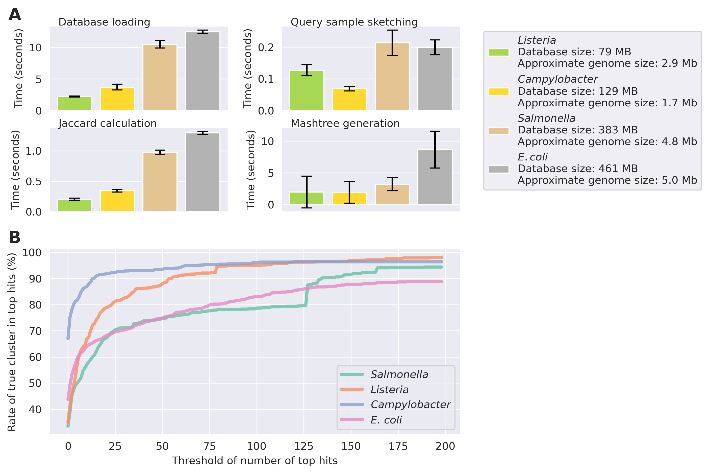

# Summary

We are in the era of genomic epidemiology.
The surveillance of many transmissible diseases is increasingly being conducted through whole genome sequencing of pathogenic agents. 
One notable example is _Salmonella_, a major foodborne pathogen routinely sequenced by surveillance programs such as PulseNet. 
Large volumes of _Salmonella_ genomes from these programs are deposited in database systems including NCBI [@nadon2017pulsenet]. 
These publicly available genomes can be analyzed in a variety of ways such as serotyping [@zhang2019seqsero2],
multilocus sequence typing (MLST) [@zhou2020enterobase], and single nucleotide polymorphism (SNP) typing [@katz2017comparative].
These analyses provide important laboratory evidence for outbreak surveillance and investigation.

As of August 2024, there are more than 600 thousand _Salmonella_ genomes and more than half a million other pathogen genomes at NCBI Pathogen Detection (https://www.ncbi.nlm.nih.gov/pathogens).
These numbers are expected to increase dramatically and therefore faster methods are needed.

There have been some major advances to scale up bioinformatic analyses to large volumes of pathogenic genomes.
One approach is to provide centralized resources that integrate data and analytical tools.
For example, Pathogen Detection combines information from three databases: SRA, GenBank, and BioSample.
About once a day, it compares all genomes of a given taxon, separates all genomes into individual clusters using MLST, and then creates a phylogeny for each cluster using SNP analysis.
This method is quite comprehensive, but it relies on each sample being public, and it cannot be executed locally.

Another approach is to provide new tools for decentralized and customized manipulation of genomics resources.
We observed that an algorithm for genomics called Min-Hash is well positioned for this purpose.
A commonly used software for Min-Hash is called Mash [@ondov2016mash].
Querying with Mash can be about 3 orders of magnitude faster than other common methods like Basic Local Alignment Search Tool (BLAST) and can have a smaller disk footprint [@camacho2009blast].
Therefore it can be run on more common scientific workstations.

We present Mashpit, a new rapid genomic epidemiology platform to query against these large groups of genomes on a local computer.

# Statement of need 

Querying a sample against these magnitudes of genomes is becoming less sustainable, especially for smaller laboratories.
Currently, GISAID and NCBI are staying ahead of the curve by producing a global tree of each organism every day.
This requires herculean efforts, cutting edge algorithms, and powerful computers.
However, smaller laboratories usually have a scientific workstation or similar equipment, much different than a cluster computing system.

We note that for some organisms like Salmonella, queries can be of a sensitive nature.
For example, harboring isolates in food production environments that are related to outbreak isolates is often perceived as a potential liability by food establishments, therefore thwarting the efforts to use and share the genomes of these organisms.

To address any needs for speed and sensitivity, we created Mashpit.
Mashpit queries genomes locally using Mash, thereby achieving speedy results while keeping any sensitive queries offline.

# Mashpit design

Mashpit is comprised of three major parts: A min-hash database, its associated metadata, and the min-hash querying.

The database is created with an interface to Mash, called Sourmash [@Brown2016].
Each genome is imported by sketching it and adding it to a Sourmash signature database.
Each genome can also have an entry in the associated metadata.
These data include date of isolation, geography, host age range, and other information that could be useful in an epidemiological investigation.
Mashpit can build a species database from NCBI Pathogen Detection, termed a Mashpit taxon database or a custom database from user-provided genomes. The Mashpit taxon database is based on the available pathogen species on Pathogen Detection. For each SNP cluster of one species on Pathogen Detection, the set of all genomes in an SNP cluster is defined as:
$$G=\{g_1,g_2,…,g_n\}$$
where n is the number of genomes in the cluster.
The centroid genome $g_c$ is calculated as:
$$g_c=\underset{g_i∈G}{argmin}\sum_{j=1}^{n} d(g_i,g_j)$$
Where $d(g_i,g_j)$ is the distance between two genomes.
By default, Mashpit will download the latest SNP cluster for specified species and uses a kmer size of 31 and kmer number of 1000 for sketching the genomes. 

To evaluate the performance of Mashpit, we tested Mashpit on a server that runs Ubuntu 20.04.2 with an Intel Xeon CPU E5-2697 v4 2.30GHz and 256GB RAM. The elapsed time of building a database and running a query was calculated for four of the major foodborne pathogens: _Salmonella_, _Listeria_, _E. coli_, and _Campylobactor_.

With the database and its metadata complete, a user could perform a query.
The query is an assembly fasta file, which is then sketched and compared against the signature database.
The query then returns a tab delimited spreadsheet, sorted by Mash distance and a phylogenetic tree based on the Mash distance.
All associated metadata are included in the spreadsheet.

# Performance

We evaluated Mashpit's performance using 1000 query genomes against _Salmonella_, _Listeria_, _E. coli_, and _Campylobacter_ Mashpit taxon databases, built from SNP clusters defined by NCBI pathogen detection in January 2024. To assess sensitivity, we randomly selected 1000 newly added genomes post-January 2024 and examined Mashpit's ability to identify the true SNP cluster within the top output hits. The average speed of the query is shown in Figure A(\autoref{fig:figure}). The rate of true SNP clusters being in the top hits with different thresholds is shown in Figure B(\autoref{fig:figure}).

# Discussion

We present Mashpit, a rapid genomic epidemiology platform.
Due to the underlying algorithm Min-Hash, it is exceedingly fast.
It also has such a small hard drive and computational footprint that it can basically be used on common scientific workstations.
However, we note that the Mash distance does not correlate well to well-established distances such as MLST.
Therefore we recommend that this platform is used as a first-pass to filter unrelated samples before using a more established protocol such as MLST.
In conclusion, we believe that Mashpit is an essential genomic epidemiology tool.

# Figures

# Acknowledgements

Financial support for the development of Mashpit was provided by the Center for Food Safety at the University of Georgia, USA.
The findings and conclusions in this report are those of the authors and do not necessarily represent the official position of the Centers for Disease Control and Prevention.

# References

